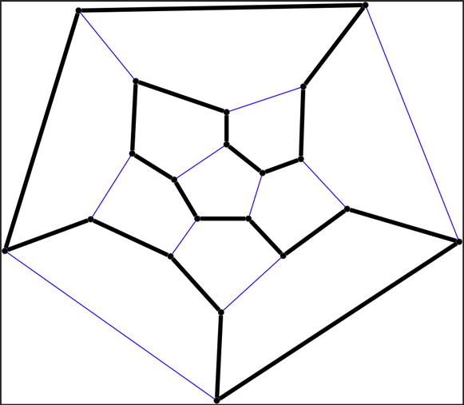
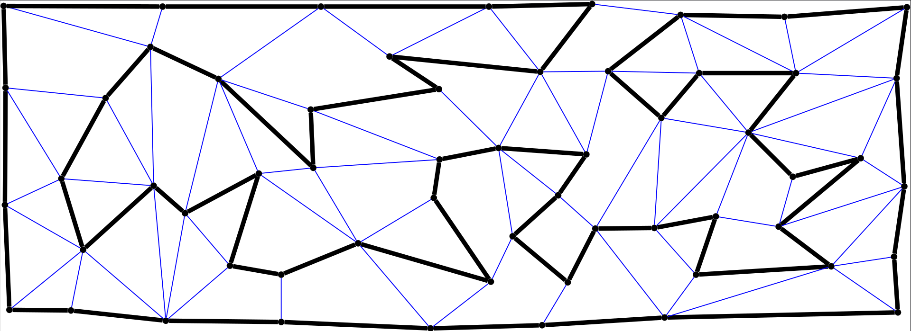

# Nemertea: Territorial Expansion-Based Algorithm for the Hamiltonian Cycle Problem

Nemertea is a C++ implementation of a territorial-expansion algorithm to tackle the Hamiltonian Cycle Problem (HCP).



## Features
- Territorial expansion strategy to find Hamiltonian cycles.
- Command-line interface for execution and configuration.
- Accepts input graphs in JSON format.

## Input JSON format

The input graph files were created using the [Grafuria](https://codeberg.org/saulopz/grafuria) program.

Example (valid JSON — no trailing commas):

```json
{
  "bidirectional": true,
  "vertex": [
    { "name": "A", "id": 0, "x": 0, "y": 0 },
    { "name": "B", "id": 1, "x": 10, "y": 10 }
  ],
  "edge": [
    { "id": 0, "a": 0, "b": 1, "weight": 1.0 }
  ]
}
```

Fields:
- `bidirectional`: whether the graph is undirected.
- `vertex`: list of vertices with `name`, `id`, `x`, `y`.
- `edge`: list of edges with `id`, `a`, `b`, `weight` (`a` and `b` are vertex ids).

## Requirements

| Tool   | Version   | Notes                                      |
|--------|-----------|--------------------------------------------|
| CMake  | ≥ 3.21    | [cmake.org/download](https://cmake.org/download) |
| C++ compiler | C++23 support | g++ ≥ 11, clang++ ≥ 14, or MSVC 2022 |
| Git    | any       | Required for dependency download           |
| Internet access | — | Only on first build (downloads nlohmann/json automatically) |

> **nlohmann/json** is fetched automatically during the build. No manual installation required.


## Build

### Linux / macOS

```bash
cmake -B build
cmake --build build
```

Executable: `build/nemertea`

### Windows (MSVC — Visual Studio 2022)

```bash
cmake -B build
cmake --build build --config Release
```

Executable: `build\Release\nemertea.exe`

### Windows (MinGW / MSYS2)

```bash
cmake -B build -G "MinGW Makefiles"
cmake --build build
```

---

### Debug build (for segfault investigation)

```bash
cmake -B build -DCMAKE_BUILD_TYPE=Debug
cmake --build build
```

## Run

```bash
build/nemertea --graph graphs/my_graph.json --depth 7
```

Adjust parameters as needed.

# Graph Results

- The algorithm outputs whether a Hamiltonian cycle was found and the cycle itself if successful in dot format (graphviz) with same name as input file but with `.dot` extension.

## Example Graphs



## License & Contact
© 2021-Present Saulo Popov Zambiasi — All Rights Reserved (Pending Open Source Release post-publication).

**Contact:** saulopz@gmail.com
