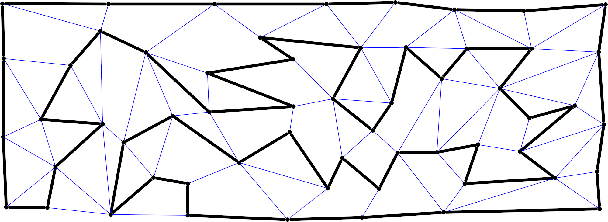

# Nemertea: Territorial Expansion-Based Algorithm for the Hamiltonian Cycle Problem

Nemertea is a C++ implementation of a territorial-expansion algorithm to tackle the **Hamiltonian Cycle Problem (HCP)**.

Nemertea is a C++23 suite designed to solve and benchmark the **Hamiltonian Cycle Problem (HCP)**. Performance is also compared with classic approaches such as Backtracking and Warnsdorff's heuristic.


## 🧬 Algorithm Suite
This repository contains a unified environment to provide a comprehensive performance analysis:
- **Nemertea**: The proposed territorial expansion algorithm (High-performance BFS-based).
- **Backtracking**: A standard exhaustive search (Baseline).
- **Warnsdorff**: A greedy heuristic adapted for Hamiltonian paths.

## 🛠 Requirements

| Tool | Version | Notes |
| :--- | :--- | :--- |
| **CMake** | ≥ 3.21 | Build system generator |
| **C++ Compiler** | C++23 | GCC 13+, Clang 15+, or MSVC 2022 |
| **Python** | 3.8+ | Required for the **benchmark suite** |
| **Git** | any | To fetch `nlohmann/json` automatically |

## 🚀 Build Instructions

The project uses a unified CMake structure. All executables are placed in `build/bin`.

### Linux / macOS
```bash
cmake -B build -DCMAKE_BUILD_TYPE=Release
cmake --build build -j$(nproc)
```

### Windows (PowerShell / CMD)
```powershell
cmake -B build
cmake --build build --config Release
```


## 📊 Benchmarking

We provide a specialized Python script to execute multiple runs, handle timeouts, and calculate performance metrics (Median, Min, Max) across different graphs.

### Running the Benchmark
From the root directory:
```bash
python3 scripts/benchmark.py <runs> <timeout_in_seconds>
```
*Example: `python3 scripts/benchmark.py 10 60`*

### Results
- **Terminal**: Real-time progress with status (`FOUND`, `NOT_FOUND`, `TIMEOUT`, `INCONCLUSIVE`).
- **CSV**: Detailed logs saved in `results/benchmark_TIMESTAMP.csv`.
- **DOT**: Generated cycles are saved in `results/dot_TIMESTAMP/` for visualization.

## 📂 Input & Data Format

The suite accepts graphs in JSON format (compatible with [Grafuria](https://codeberg.org/saulopz/grafuria)).

```json
{
  "bidirectional": true,
  "vertex": [
    { "name": "A", "id": 0, "x": 0, "y": 0 },
    { "name": "B", "id": 1, "x": 10, "y": 10 }
  ],
  "edge": [
    { "id": 0, "a": 0, "b": 1, "weight": 1.0 }
  ]
}
```

## 🧪 Manual Execution
If you wish to run a single test manually:
```bash
# Nemertea
./build/bin/nemertea --graph graphs/02_hypercube4d.json --depth 7

# Backtracking / Warnsdorff
./build/bin/backtracking graphs/02_hypercube4d.json output.dot 60
```

## Example Graphs




## 📜 License & Contact
© 2021-2026 **Saulo Popov Zambiasi** — All Rights Reserved.
*Note: Full Open Source release planned post-publication.*

**Contact:** saulopz@gmail.com
